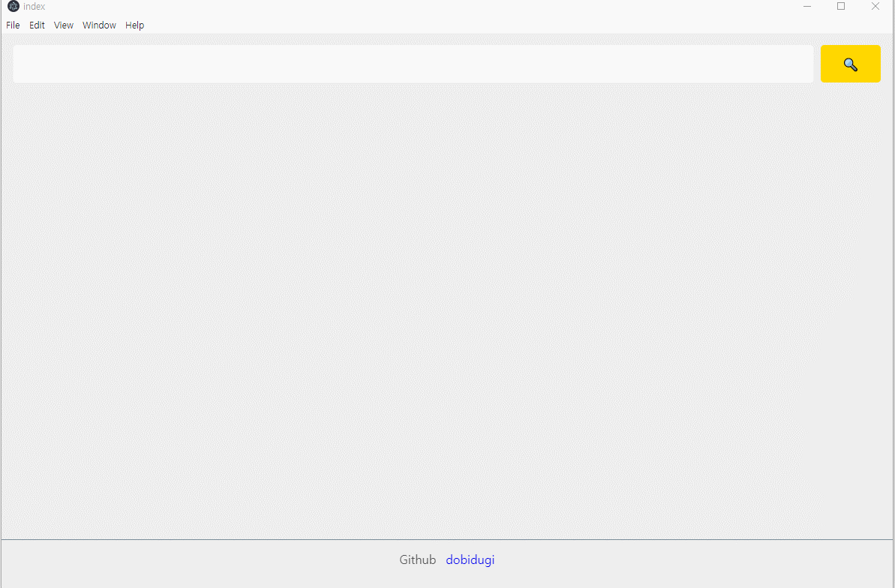

# YoutubeMusicPlayer
### electron youtube music player 
<br>
<br>

```bash
git clone https://github.com/dobidugi/YoutubeMusicPlayer
cd YoutubeMusicPlayer
npm install
npm start
```

### main



<br>

### player


<br>

## GUI
### electron
<br>

## FrontEnd 
### VanliaJs css html axios 
<br>

## Backend
### nodejs express yt-search youtube-dl

<br>

#### 2020.06.30 yt-search 동작안해서 검색이되질않음 
